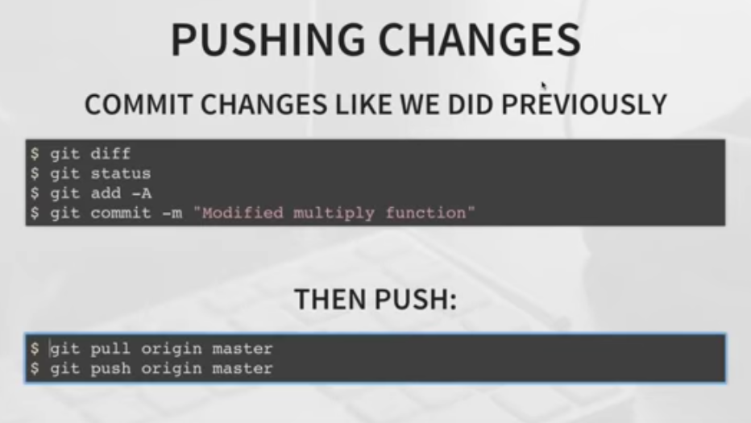

# Notes for Git

* git --version
* git config --global user.name "jai1408"
* git config --global user.email "jaishankarmishra17@gmail.com"
* git config --list
* git help verb/config
* git init
* git remote update origin --prune **For updating remote branches**
* git branch -d feature/directives **For deleting any branch**
* git branch **show local branch**
* git branch -a **show all branch**
* git branch -r **show remote branch**

***

***

***
